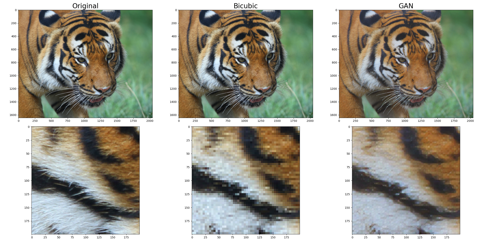

## Super-Resolution Gan
#### Implementation by Liam Pavlovic

###
This project implements a generative adversarial network for the single-image super-resolution task. The implementation is based on the Super-Resolution GAN (SR-GAN) [1] and Enhanced Super-Resolution GAN (ESR-GAN) [2] papers. Check out the demo notebook to see results.

### Sources
[1] Ledig, Christian, et al. "Photo-realistic single image super-resolution using a generative adversarial network." Proceedings of the IEEE conference on computer vision and pattern recognition. 2017.

[2] Wang, Xintao, et al. "Esrgan: Enhanced super-resolution generative adversarial networks." Proceedings of the European conference on computer vision (ECCV) workshops. 2018. 

